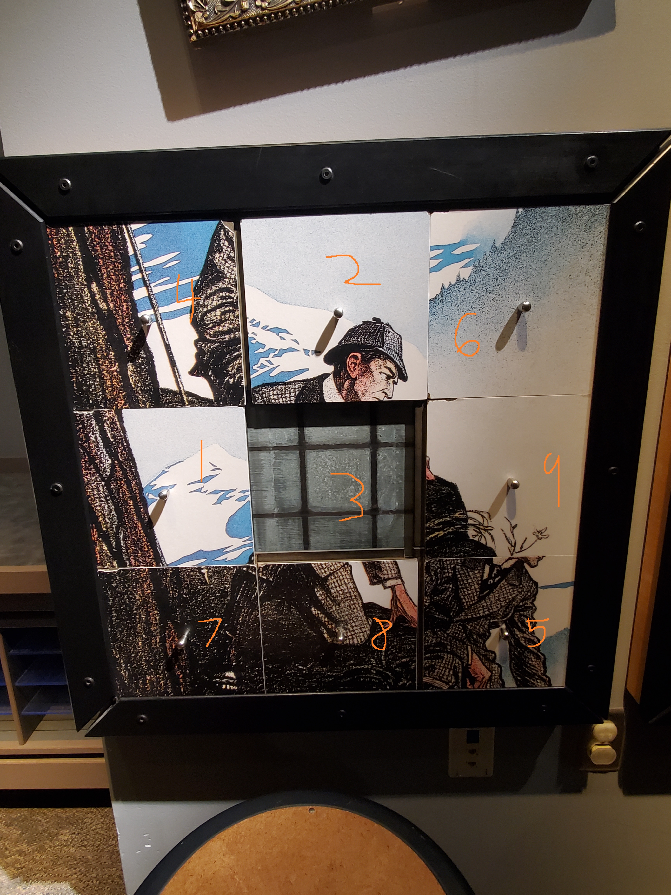
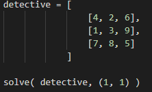
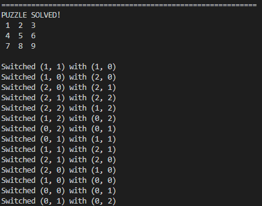

<h1>SlidingPuzzleSolver</h1>
  
Desc: The program solves sliding puzzles.

<ol>
  <dl>Here are the steps to solve the puzzle with my program.</dl>
  <li>Figure out where each tile should be in a completed puzzle</li>
  <li>Label each tile with the corresponding value e.g., 1, 2 3, ..., 9</li>
  <li>Create the matrix in python, call the solve function with matrix and the location of the initial blank space</li>
</ol>

<h2>The Detective Puzzle not solved:</h2>

<h2>The Detective puzzle with the pieces moved to the correct location for identification:</h2>

<h2>The Detective Puzzle numbered:</h2>

<h2>The detective matrix declared and the function call:</h2>

<h2>The output of the program running for the detective:</h2>

